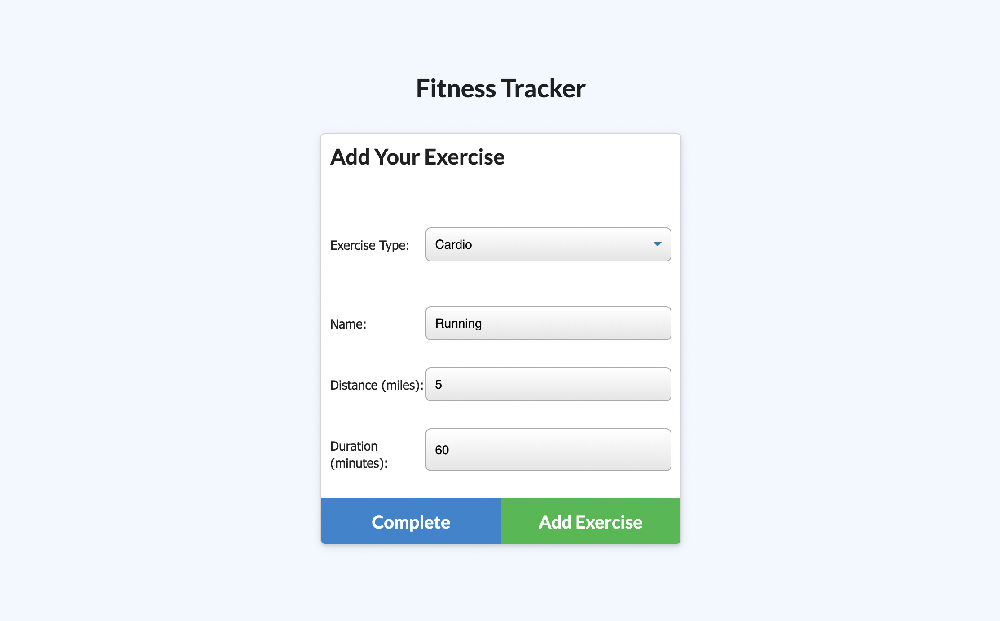

# Workout Tracker

## Description
Create daily workouts and track your progress.

## Table of Contents

- [Installation](#installation)
- [Usage](#usage)
- [Mockup](#mockup)
- [License](#license)
- [Contribution](#contribution)
- [Questions](#questions)

## Installation
Fork this repository and clone it to your local environment. Once cloned, install the necessary dependencies for this project using npm install. 

```
npm i
node server.js or npm start
```

This will launch the server to http://localhost:3000 which you can visit in your browser.

## Usage

This project utilizes JavaScript, Bootstrap, Node, Express, and MongoDB. Functionality includes the ability to add a new workout, add sets, reps, duration, total weight lifted, and number of exercises before. The application also includes a workout dashboard that shows continual progress over a span of time.

## Demo

Upon opening the application, a user is greeted with their previously logged workout.


When adding a workout, users can choose between a cardio or resistance workout type and name it whatever they like. If choosing a cardio workout they can set distance and duration, and if choosing a resistance workout, can set weight, sets, reps, and duration.



After hitting complete, the user is returned to the main page where their logged workout's stats are posted. Selecting "Dashboard" takes them to a page that logs their workout duration and weight on a graph and lists it chronologically for tracking purposes.


## License

This application is licensed under MIT.

## Contribution

If you'd like to contribute, please add your code and create a pull request.

---

## Questions?
For any questions, please see my GitHub or contact me via e-mail. Thank you!

GitHub: [luminescify](https://github.com/luminescify)

E-mail: ileahd96@gmail.com